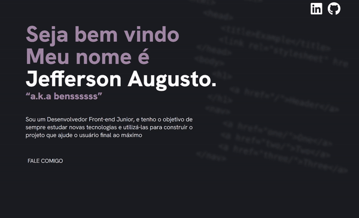
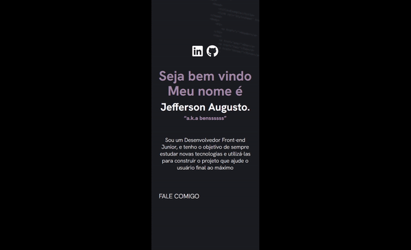

# Portfólio do Bens - Desenvolvimento Web
### Portfólio com Projetos de Programação Front End e Desenvolvimento Web, Mostrando projetos nas linguagens CSS e HTML - com práticas como Cleancode, Display Grid e Flex por - Jefferson Augusto.

---

# Processo

## Design
### Design e layout feito usando pacote Adobe 

1 - Obter referência e layout

2 - Escolher tema e obter assets

3 - Escolher cores

## Planejamento

1 - Fazer desenho de caixas (grid-flex) antes de escrever qualquer código, definindo quais elementos serão usados (desenho no pdf abaixo)

### Aqui há um pdf com todos os assets, design, planejamento e referência de layout

([Design-portfolio-assets](https://drive.google.com/file/d/1abetNU-N5B7fVq0nYFDmK9oYWO3xjSui/view?usp=sharing))

---

## Código
### Optei por começar no mobile primeiro em 320px (mobile first)

Criei um container com grid, com duas colunas (height: auto) e 4 linhas (uma para cada seção da landing page), 

### Hero (principal) Section

Como grande parte do conteúdo é texto, só precisei definir h2 e p`s, e um "anchor" na parte do "FALE COMIGO", e um "anchor" para cada icones de mídia social (linkedin e github) foram feitos com a biblioteca do font-awesome "que permite inserir icones e estiliza-los como se fossem textos", :hover foi inserido no "FALE COMIGO" e nesses icones

### Tech (tecnologias) Section

Defini Display: flex; com flex-direction: column; e criei 5 containers (uma para cada tecnologia), defini um unico container para todos os elementos para estilizar eles apenas uma vez (usando o mesmo container para todas as tecnologias apenas adicionando mais um classe para estilos individuais) 

### Projects (Projetos) Section

Novamente defini um container para ser usado para cada projeto para estilizar eles apenas uma vez, apenas mudando dados no HTML, abaixo do gif eu defini um "p" para o titulo, foi usado font-awesome novamente no elemento repositorio, um "anchor" foi definido com um link para o repositorio no github do determinado projeto, assim como o link para o github pages

:hovers foram adicionados nos elementos "Repositórios e GitHub Pages"

### Contact (Contato) Section

A seção Contato, assim como a "Hero" é composto apenas por texto e os icones de midia social (usei o mesmos estilos usados na "hero", mudando apeans a cor dos icones e do :hover dos mesmos)

## Responsividade

Utilizei 4 breakpoints

### 320px
- Tamanho que foi usado para fazer o layout inicial (mobile-first)

### 440px
- Tamanhos de fontes da "hero page" foram alteradas para melhor visibilidade 
- Tamanho das imagens "gif" foram alteradas para 95% da tela 

### 768px 
- Textos da "hero page" e "contact-page" foram alinhadas na esquerda
- Icones da "hero page" e "contact-page" foram alinhadas na direita
- Textos novamente foram redimensionados para melhor visibilidade
- Projetc Page foi definida para flex-direction: column;
- A propriedade flex-wrap: wrap; foi definida para que haja a quebra pra segunda linha se a largura de um conjunto de elementos for maior que a area disponivel em seu "container-parent" 
- Largura do container dos Projetos foram definidos para que caibam apenas 2 em cada coluna 

### 1280px
- Todos os elementos foram escalados para melhor visibilidade

### Fazer versionamento quando;
- Html escrito
- Css escrito
- Clean code
- Ajuste de metadata e inserção de "Readme.md"

# Tecnologias utilizadas
- HTML5 Markup 
- CSS
- Clean Code
- Photoshop
- Illustrator
- Responsividade

# O que eu aprendi

#### CSS
- Usar wrap e elementos de larguras fixas para criar uma lista que quebra pra uma segunda linha quando o tamanho de seu container pai for menor que esse tamanho

- Uso de Display: grid; para criar paginas que tenham varias seções uma abaixo da outra (como em uma landing page)

- Usar icones da biblioteca do font-awesome

- Usar conceitos solidos de responsividade como breakpoints, e mudança de sentido de elementos com flex: column e row

# Dificuldades

Alinhamento vertical de texto "solucionado usando align-items: baseline;", quebra de elementos em resoluções menores por falta de responsividade 

---

# Autor
### Jefferson Augusto (a.k.a Benssssss) 
## [Linkedin](https://www.linkedin.com/in/benssssss/)

## Projeto Nº6
